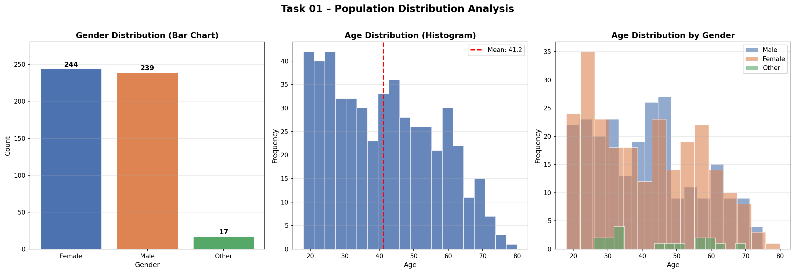
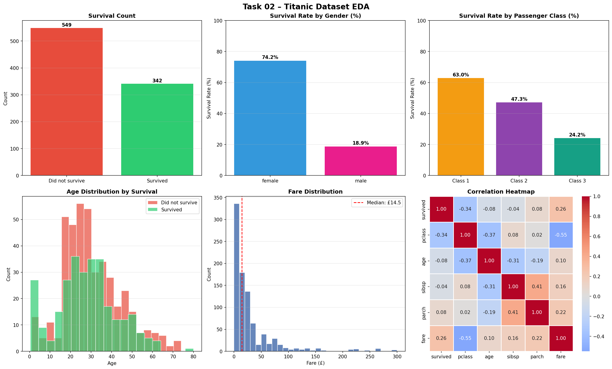
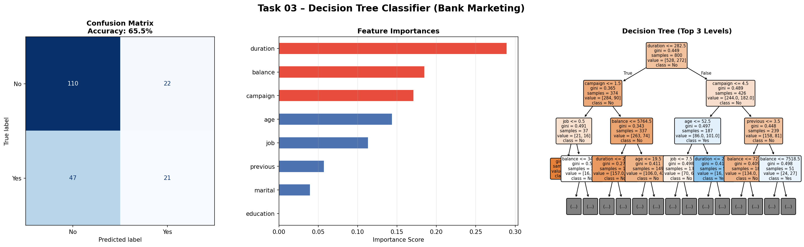
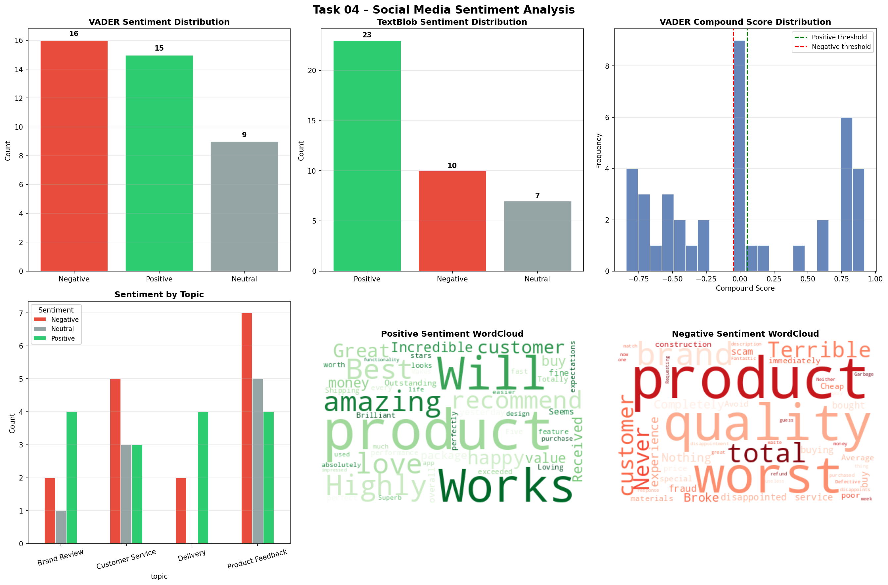
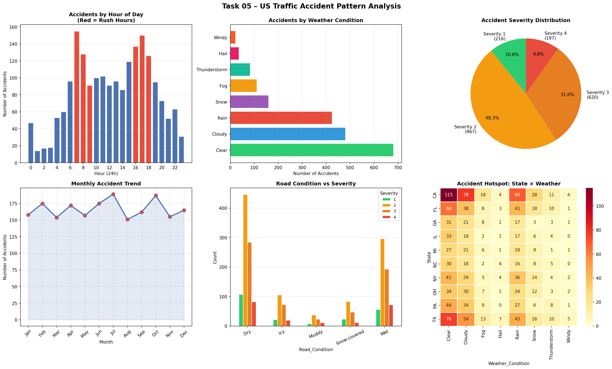

# 🔬 Prodigy InfoTech — Data Science Internship

## 📌 About
This repository contains all 5 Data Science tasks completed during my
1-month Data Science Internship at **Prodigy InfoTech** (May 2026).

Each task involves real-world data analysis, machine learning, 
and data visualization using Python.

---

## 📂 Tasks Overview

| Task | Topic | Libraries Used |
|------|-------|---------------|
| Task 01 | Bar chart & histogram of population data | Matplotlib, Seaborn |
| Task 02 | EDA & data cleaning on Titanic dataset | pandas, NumPy, Seaborn |
| Task 03 | Decision Tree classifier on Bank Marketing data | scikit-learn |
| Task 04 | Sentiment analysis on social media data | VADER, TextBlob, WordCloud |
| Task 05 | US Traffic Accident pattern analysis | Folium, Plotly, Seaborn |

---

## ⚙️ How to Run

**1. Clone this repository:**
git clone https://github.com/Rohan607p/prodigy-infotech-tasks.git

**2. Install required libraries:**
pip install pandas numpy matplotlib seaborn scikit-learn wordcloud vaderSentiment textblob plotly folium

**3. Run any task:**
python task01_visualization.py
python task02_eda_titanic.py
python task03_decision_tree.py
python task04_sentiment.py
python task05_accident_analysis.py

---

## 📊 Output Previews

### Task 01 — Population Distribution

### Task 02 — Titanic EDA

### Task 03 — Decision Tree Classifier

### Task 04 — Sentiment Analysis

### Task 05 — Traffic Accident Analysis

---

## 🛠️ Tech Stack
- **Language:** Python 3.x
- **Libraries:** pandas, NumPy, Matplotlib, Seaborn, scikit-learn,
  VADER, TextBlob, WordCloud, Plotly, Folium
- **Tools:** VS Code, Git, GitHub, Jupyter Notebook

---

## 👤 Author
**Rohan Patil**
- LinkedIn: linkedin.com/in/rohan-patil-tech
- GitHub: github.com/Rohan607p

---
⭐ If you found this helpful, please star this repository!

